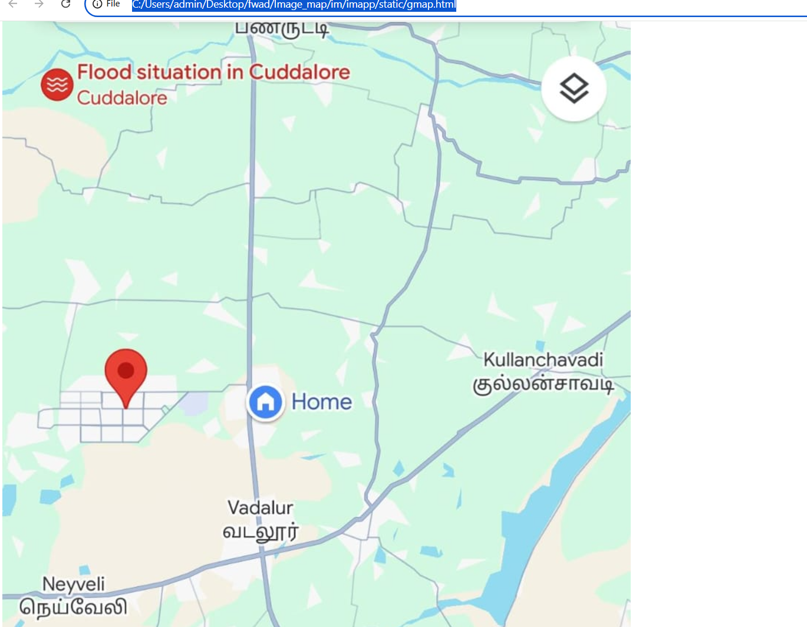

# Ex04 Places Around Me
# Date:04/11/24
# AIM
To develop a website to display details about the places around my house.

# DESIGN STEPS
## STEP 1
Create a Django admin interface.

## STEP 2
Download your city map from Google.

## STEP 3
Using <map> tag name the map.

## STEP 4
Create clickable regions in the image using <area> tag.

## STEP 5
Write HTML programs for all the regions identified.

## STEP 6
Execute the programs and publish them.

# CODE
```
!DOCTYPE html>
<html lang="en">
<head>
    <meta charset="UTF-8">
    <meta name="viewport" content="width=device-width, initial-scale=1.0">
    <title>Document</title>
</head>
<body>
    <div class="container">
        <div class="container">
        <!-- Image Map Generated by http://www.image-map.net/ -->


<map name="image-map">
    <area target="" alt="Panruti" title="Panruti" href="file:///C:/Users/admin/Desktop/fwad/Image_map/im/imapp/static/panruti.html" coords="298,111,302,136,451,138,442,100" shape="poly">
    <area target="" alt="Kullanchavadi" title="Kullanchavadi" href="file:///C:/Users/admin/Desktop/fwad/Image_map/im/imapp/static/kullanchavadi.html" coords="636,538,636,631,820,643,816,538" shape="poly">
    <area target="" alt="Neyveli" title="Neyveli" href="file:///C:/Users/admin/Desktop/fwad/Image_map/im/imapp/static/neyveli.html" coords="188,842,17,836,14,943,172,957" shape="poly">
    <area target="" alt="NeyveliTs" title="NeyveliTs" href="file:///C:/Users/admin/Desktop/fwad/Image_map/im/imapp/static/neyveli.ts.html" coords="248,536,53,540,44,720,233,717" shape="poly">
    <area target="" alt="Panruti" title="Panruti" href="file:///C:/Users/admin/Desktop/fwad/Image_map/im/imapp/static/neyveli.ts.html" coords="290,734,433,740,420,847,296,841" shape="poly">
</map>
        </div> 
    </div>
</body>
</html>
~~~
<!DOCTYPE html>
<html lang="en">
<head>
    <meta charset="UTF-8">
    <meta name="viewport" content="width=device-width, initial-scale=1.0">
    <title>Simple Web Page</title>
    
    <style>

body, html {
    margin: 0;
    padding: 0;
    height: 100%;
}


body {
    background:url(neyveli.jpg);
    
    background-size: cover; 
    background-repeat: no-repeat; 
    background-position: center; 
    font-family: Arial, sans-serif; 
    color: white; 
    text-align: center; 
}


header {
    margin-top: 20%;
    background-color: rgba(0, 0, 0, 0.5); 
    padding: 20px;
    border-radius: 10px;
    display: inline-block;
}

        </style>
</head>
<body>
    <header>
        <h1>neyveli</h1>
        <p>Area near neyevli mines with beautiful view<br>
           This palce is rich of minerals and near to viruthachalam which is famous for temple site <p>
    </header>
</body>
</html>
```
```
<!DOCTYPE html>
<html lang="en">
<head>
    <meta charset="UTF-8">
    <meta name="viewport" content="width=device-width, initial-scale=1.0">
    <title>Simple Web Page</title>
    
    <style>

body, html {
    margin: 0;
    padding: 0;
    height: 100%;
}


body {
    background: url(vadalur.jpg);
    
    background-size: cover; 
    background-repeat: no-repeat; 
    background-position: center; 
    font-family: Arial, sans-serif; 
    color: white; 
    text-align: center; 
}


header {
    margin-top: 20%;
    background-color: rgba(0, 0, 0, 0.5); 
    padding: 20px;
    border-radius: 10px;
    display: inline-block;
}

        </style>
</head>
<body>
    <header>
        <h1>Vadalur</h1>
        <p>Ramalinga Swamigal, often called Vallalar, established the Sathyagnana Sabhai. He built a temple which is open year-round. Thousands of visitors attend festivals and monthly puja dates at this temple. Vadalur is well connected by rail and road, and it provides transport to major cities like Trichy, Chennai, Tanjore, Puducherry, and Kumbakonam.<br>
            The Thai Poosam (Tamil: தைப்பூசம்) celebration in January is a festival held annually in Vadalur. The Swamigal sang thousands of songs called Thiru Arutppa<p>
    </header>
</body>
</html>

<!DOCTYPE html>
<html lang="en">
<head>
    <meta charset="UTF-8">
    <meta name="viewport" content="width=device-width, initial-scale=1.0">
    <title>Simple Web Page</title>
    
    <style>

body, html {
    margin: 0;
    padding: 0;
    height: 100%;
}


body {
    background:url(kullanachavadi.jpg);
    
    background-size: cover; 
    background-repeat: no-repeat; 
    background-position: center; 
    font-family: Arial, sans-serif; 
    color: white; 
    text-align: center; 
}


header {
    margin-top: 20%;
    background-color: rgba(0, 0, 0, 0.5); 
    padding: 20px;
    border-radius: 10px;
    display: inline-block;
}

        </style>
</head>
<body>
    <header>
        <h1>Kullanachavadi</h1>
        <p>Panruti is a town, municipality and taluk headquarters of Cuddalore district, Tamil Nadu, India. Panruti is located between Cuddalore and Neyveli. Panruti is famous for jackfruits and cashew nuts. The jackfruit grown here is exported worldwide and is very sweet. It is a business capital of Cuddalore district<br>
        The Virudhagiriswarar temple (or Pazhamalai Nadhar Temple) dedicated to Lord Shiva is located in the heart of town.[4] This is the 41st Sivan temple to be sung about in Thevāram and 9th Temple to be sung about in Nadunādu[5] Moovar has sung hymns in praise of Lord Siva of this temple. The temple was constructed by one of the Chola Emperors. The famous Kolanjiappar Temple is located 3 km away from the town. Both of them are situated near Cuddalore - Salem highway in Virudhachalam. The temple has been mentioned in the travalogue Tirtha Prabandha written by Madhwa saint Vadiraja tirtharu in sixteenth century.<p>
    </header>
</body>
</html>
```
```
<!DOCTYPE html>
<html lang="en">
<head>
    <meta charset="UTF-8">
    <meta name="viewport" content="width=device-width, initial-scale=1.0">
    <title>Simple Web Page</title>
    
    <style>

body, html {
    margin: 0;
    padding: 0;
    height: 100%;
}


body {
    background: url(panruti.jpg);
    
    background-size: cover; 
    background-repeat: no-repeat; 
    background-position: center; 
    font-family: Arial, sans-serif; 
    color: white; 
    text-align: center; 
}


header {
    margin-top: 20%;
    background-color: rgba(0, 0, 0, 0.5); 
    padding: 20px;
    border-radius: 10px;
    display: inline-block;
}

        </style>
</head>
<body>
    <header>
        <h1>Panruti</h1>
        <p>Panruti is a town, municipality and taluk headquarters of Cuddalore district, Tamil Nadu, India. Panruti is located between Cuddalore and Neyveli. Panruti is famous for jackfruits and cashew nuts. The jackfruit grown here is exported worldwide and is very sweet. It is a business capital of Cuddalore district<br>
            Panruti is a town, municipality and taluk headquarters of Cuddalore district, Tamil Nadu, India. Panruti is located between Cuddalore and Neyveli. Panruti is famous for jackfruits and cashew nuts. The jackfruit grown here is exported worldwide and is very sweet. It is a business capital of Cuddalore district <p>
    </header>
</body>
</html>
```
```
<!DOCTYPE html>
<html lang="en">
<head>
    <meta charset="UTF-8">
    <meta name="viewport" content="width=device-width, initial-scale=1.0">
    <title>Simple Web Page</title>
    
    <style>

body, html {
    margin: 0;
    padding: 0;
    height: 100%;
}


body {
    background:url(kullanachavadi.jpg);
    
    background-size: cover; 
    background-repeat: no-repeat; 
    background-position: center; 
    font-family: Arial, sans-serif; 
    color: white; 
    text-align: center; 
}


header {
    margin-top: 20%;
    background-color: rgba(0, 0, 0, 0.5); 
    padding: 20px;
    border-radius: 10px;
    display: inline-block;
}

        </style>
</head>
<body>
    <header>
        <h1>Kullanachavadi</h1>
        <p>Panruti is a town, municipality and taluk headquarters of Cuddalore district, Tamil Nadu, India. Panruti is located between Cuddalore and Neyveli. Panruti is famous for jackfruits and cashew nuts. The jackfruit grown here is exported worldwide and is very sweet. It is a business capital of Cuddalore district<br>
        The Virudhagiriswarar temple (or Pazhamalai Nadhar Temple) dedicated to Lord Shiva is located in the heart of town.[4] This is the 41st Sivan temple to be sung about in Thevāram and 9th Temple to be sung about in Nadunādu[5] Moovar has sung hymns in praise of Lord Siva of this temple. The temple was constructed by one of the Chola Emperors. The famous Kolanjiappar Temple is located 3 km away from the town. Both of them are situated near Cuddalore - Salem highway in Virudhachalam. The temple has been mentioned in the travalogue Tirtha Prabandha written by Madhwa saint Vadiraja tirtharu in sixteenth century.<p>
    </header>
</body>
</html>
```

## OUTPUT



# RESULT
The program for implementing image maps using HTML is executed successfully.
